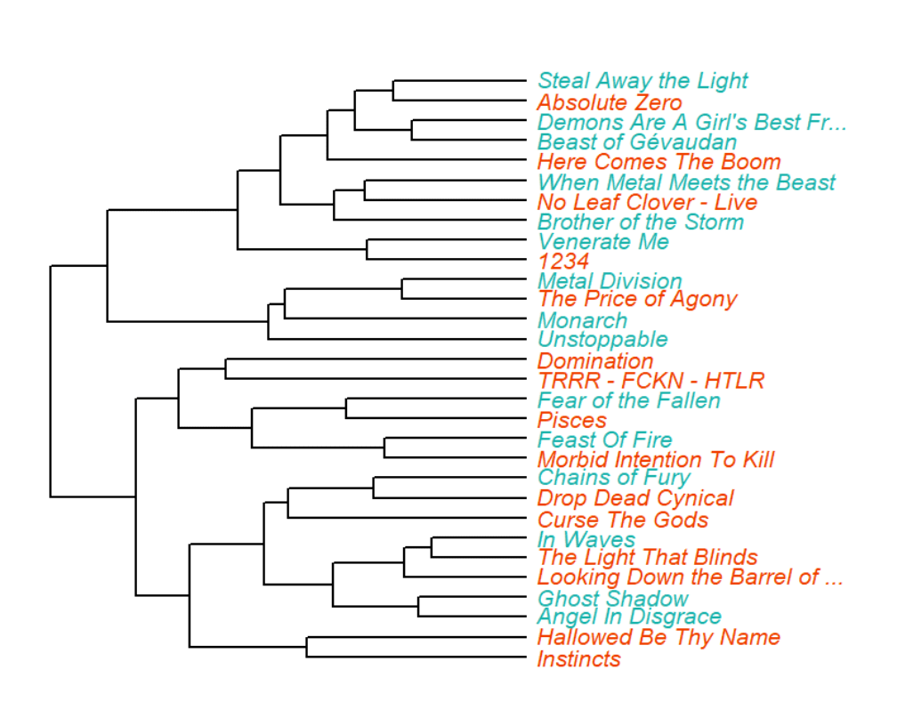

<style>
.sbframe-commentary {
  width: 400px;
}
</style>

```{r setup, include=FALSE}
knitr::opts_chunk$set(echo = TRUE)
library(tidyverse)
library(spotifyr)
library(compmus)
library(dplyr)
library(ggplot2)
library(plotly)
library(Cairo)
library(tidymodels)
library(ggdendro)
library(heatmaply)
library(knitr)
library(dendextend)
library(ape)
```


### Introduction to my corpus: Do Spotify and I have the same vision on heavy metal?

<h1>Heavy metal: Femke vs Spotify</h1>

For my corpus, I will be using two playlist made specifically of heavy metal songs. One of those was made by me around a year ago and the other is made by Spotify itself. I’m interested in the difference between the musical elements of each playlist. I wonder if my perception of ‘heavy metal’ will be the same as Spotify’s and what exactly the differences are. In this portfolio I will be comparing the Spotify-, chroma-, timbre-, and tempo- features of the two playlists. 

I think there will be some differences, my playlist will likely be a bit ‘heavier’, or just more extreme, but overall I think the proportions will be mainly the same. The tracks in the Spotify playlist are quite representative of the the heavy metal genre, although there might be some outliers. I do think that my own playlist might be a bit less representative, but that is what I’m trying to find out, how close I am to the actual genre. My expectation is that my own playlist will be close, but a bit messier and with a lot more outliers.

There are no typical tracks on either of the playlists that I am using. However, there are some artists that return regularly. In my own playlist they are Judas Priest, Iron Maiden and Testament, and in the Spotify playlist they are Powerwolf, Volbeat and Warkings. There are some songs that appear in both playlists: Archangel - Amaranthe, Raise your horns - Amon Amarth, A statue of the king - Avatar, The book of heavy metal - Dream evil and Blacklist - Exodus. The corresponding artist are: Amaranthe, Amon Amarth, Arch Enemy, Avatar, Dream Evil, Exodus, Gojira, Iron Maiden, Judas Priest, Machine Head, Mastodon, Metallica, Sabaton and Upon a burning body.

***
The playlists I will be using in this research, first my own and second the one by Spotify:

***

<iframe style="border-radius:12px" src="https://open.spotify.com/embed/playlist/0xKB9peSIoqMIexrmubkV3?utm_source=generator" width="100%" height="380" frameBorder="0" allowfullscreen="" allow="autoplay; clipboard-write; encrypted-media; fullscreen; picture-in-picture"></iframe>

<iframe style="border-radius:12px" src="https://open.spotify.com/embed/playlist/37i9dQZF1DX9qNs32fujYe?utm_source=generator" width="100%" height="380" frameBorder="0" allowfullscreen="" allow="autoplay; clipboard-write; encrypted-media; fullscreen; picture-in-picture"></iframe>

### According to Spotify, heavy metal is a lot less instrumental than I think

```{r week 7, echo=FALSE, fig.show="hold", out.width="50%"}

femke <- get_playlist_audio_features("", "0xKB9peSIoqMIexrmubkV3")
spotify <- get_playlist_audio_features("", "37i9dQZF1DX9qNs32fujYe")

playlists <-
  bind_rows(
    femke %>% mutate(category = "Femke"),
    spotify %>% mutate(category = "Spotify")
  )

playlistsplot <- playlists %>%
  mutate(
    mode = ifelse(mode==0, "Minor", "Major")
    ) %>%
  ggplot(
    aes(
      x = energy,
      y = tempo,
      size = instrumentalness,
      colour = mode,
      label = track.name
    )
  ) +
  geom_point(alpha = 0.65) +
  geom_rug(size = 0.1) +
  geom_text(
    aes(
      x = energy,
      y = tempo,
      label = label
    ),
    data =
      tibble(
        label = c("geen idee", "energy"),
        category = c("Femke", "Spotify"),
        tempo = c(0.090, 0.123),
        energy = c(0.101, 0.967)
      ),
    colour = "black",
    size = 3,
    hjust = "left",
    vjust = "bottom",
    nudge_x = -0.05,
    nudge_y = 0.02,
  ) +
  facet_wrap(~category) +
  scale_y_continuous(
    limits = c(50, 210),
    breaks = c(50, 100, 150, 200),
    minor_breaks = NULL
  ) +
    scale_x_continuous(
    limits = c(0.3, 1),
    breaks = c(0.3, 0.50, 1),
    minor_breaks = NULL
    ) +
    scale_colour_brewer(
     type = "qual",
      palette = "Set2",
)+
    scale_size_continuous(      
    trans = "exp",
    guide = "bins"
  ) +
  theme_light() +            
  labs(                       
    x = "Energy",
    y = "Tempo",
    colour = "Mode",
    size = "Instrumentalness",
    title = "Energy, tempo, instrumentalness and mode of Femke's and Spotify's playlists"
  )

ggplotly(playlistsplot, tooltip = c('label', 'x', 'y', 'size'))

```

***
Here are two plots from my corpora. They show the energy level (x-axis), tempo (y-axis), intrumentalness (size) and mode (colour) calculated by Spotify. I chose these features because after some research they turned out to be the most typical features of heavy metal. 

In the left plot we see the data of my own playlist. To be honest, I expected many more outliers. I thought I was not consistent at all choosing the songs for this playlist. It's interesting to see that the biggest outliers in my playlist are in the energy level whereas I expected them to be in the tempo. The energy level is a lot more consistent in Spotify's playlist. I'm also surprised that the tempo is so widespread (the expectation was mainly high tempo). The tempo is also consistent between the two playlists. Where the lists do differ is in the instrumentalness. It looks like the one in my playlist is on average a lot higher than the one in Spotify's playlist. There is little difference in mode between the two lists, in both it is very spread out, also unlike the expectation. Thus, the main difference between the playlists is the level of instrumentalness (higher in mine, lower in Spotify's) and how consistent the data is (more spread out in mine, more consistent in Spotify's). 

### Chroma features make the bridge visible, but not the difference

```{r week 8, echo=FALSE, fig.show="hold", out.width="50%"}

overthewall <-
  get_tidy_audio_analysis("5xXeIlEiWIA8xnPa8BkJyj") %>%
  select(segments) %>%
  unnest(segments) %>%
  select(start, duration, pitches)

plot_otw <- overthewall %>%
  mutate(pitches = map(pitches, compmus_normalise, "chebyshev")) %>%
  compmus_gather_chroma() %>% 
  ggplot(
    aes(
      x = start + duration / 2,
      width = duration,
      y = pitch_class,
      fill = value,
      text = sprintf("Time: %.0f seconds<br>Pitch class: %s<br>Magnitude: %s", start + duration / 2, pitch_class, value)
    )
  ) +
  geom_tile() +
  labs(x = "Time (s)", y = NULL, fill = "Magnitude", title = "Chromagram of 'Over the wall' by Testament") +
  theme_minimal() +
  scale_fill_viridis_c()


becoming <-
  get_tidy_audio_analysis("6grZ25M9c5o8T75z0tY0xq") %>%
  select(segments) %>%
  unnest(segments) %>%
  select(start, duration, pitches)

plot_becoming <- becoming %>%
  mutate(pitches = map(pitches, compmus_normalise, "chebyshev")) %>%
  compmus_gather_chroma() %>% 
  ggplot(
    aes(
      x = start + duration / 2,
      width = duration,
      y = pitch_class,
      fill = value,
      text = sprintf("Time: %.0f seconds<br>Pitch class: %s<br>Magnitude: %s", start + duration / 2, pitch_class, value)
    )
  ) +
  geom_tile() +
  labs(x = "Time (s)", y = NULL, fill = "Magnitude", title = "Chromagram of 'Becoming' by Volbeat") +
  theme_minimal() +
  scale_fill_viridis_c()

plt1 <- ggplotly(plot_otw, tooltip="text")
plt2 <- ggplotly(plot_becoming, tooltip="text")
w <- subplot(plt1, plt2)
w %>%
  layout(title = 'Over the wall vs Becoming')

```

***
<iframe style="border-radius:12px" src="https://open.spotify.com/embed/track/5xXeIlEiWIA8xnPa8BkJyj?utm_source=generator" width="100%" height="80" frameBorder="0" allowfullscreen="" allow="autoplay; clipboard-write; encrypted-media; fullscreen; picture-in-picture"></iframe>

<iframe style="border-radius:12px" src="https://open.spotify.com/embed/track/6grZ25M9c5o8T75z0tY0xq?utm_source=generator" width="100%" height="80" frameBorder="0" allowfullscreen="" allow="autoplay; clipboard-write; encrypted-media; fullscreen; picture-in-picture"></iframe>

***
Over the wall by Testament (my playlist) and Becoming by Volbeat (Spotify's playlist) are two songs that are true archetypes of my two corpora: both songs scored average on all variables of the previous plot and the artists appear frequently in the lists. 

The left chromagram shows the chroma features of Over the wall. It is immediately noticeable that this song changes a lot over its duration. There are many different instruments and sounds: drums, rhythm guitar and solo guitar, bass, and vocals. On top of that, the singer doesn't just sing, he has a kind of screaming sound. This makes for a very mixed chromagram, although the most important pitch classes are still visible. 

The second chromagram is not very different from the first one. There are some defined pitch classes, but overall there is a big spread to other notes.

In both chromagrams, the structure of the songs is somewhat visible. Until the bridge it's pretty much the same, then around 140/150 seconds you see a clear shift to other pitch classes. After this, it shifts back again. So there is little difference between both corpora in chroma features.

### The songs in my playlist have very visible timbre changes

```{r week acht, echo=FALSE, fig.show="hold", out.width="50%"}

otw_plot <-
  get_tidy_audio_analysis("5xXeIlEiWIA8xnPa8BkJyj") %>%
  compmus_align(bars, segments) %>%
  select(bars) %>%
  unnest(bars) %>%
  mutate(
    pitches =
      map(segments,
        compmus_summarise, pitches,
        method = "acentre", norm = "manhattan"
      )
  ) %>%
  mutate(
    timbre =
      map(segments,
        compmus_summarise, timbre,
        method = "mean"
      )
  )
mix_plot_1 <-bind_rows(
  otw_plot %>%
    compmus_self_similarity(pitches, "aitchison") %>%
    mutate(d = d / max(d), type = "Chroma"),
  otw_plot %>%
    compmus_self_similarity(timbre, "euclidean") %>%
    mutate(d = d / max(d), type = "Timbre")
) %>%
  mutate() %>%
  ggplot(
    aes(
      x = xstart + xduration / 2,
      width = xduration,
      y = ystart + yduration / 2,
      height = yduration,
      fill = d, 
      text=sprintf("X-time: %.0f seconds<br>Y-time: %.0f seconds<br>Delta: %.4f", xstart + xduration / 2, ystart + yduration / 2, d)
    )
  ) +
  geom_tile() +
  coord_fixed() +
  facet_wrap(~type) +
  scale_fill_viridis_c(guide = "none") +
  theme_classic() +
  labs(x = "", y = "")
becoming_plot <-
  get_tidy_audio_analysis("0t7DV1EAMVC6y3LpW6IuLk") %>%
  compmus_align(bars, segments) %>%
  select(bars) %>%
  unnest(bars) %>%
  mutate(
    pitches =
      map(segments,
        compmus_summarise, pitches,
        method = "acentre", norm = "manhattan"
      )
  ) %>%
  mutate(
    timbre =
      map(segments,
        compmus_summarise, timbre,
        method = "mean"
      )
  )
mix_plot_2 <- bind_rows(
  becoming_plot %>%
    compmus_self_similarity(pitches, "aitchison") %>%
    mutate(d = d / max(d), type = "Chroma"),
  becoming_plot %>%
    compmus_self_similarity(timbre, "euclidean") %>%
    mutate(d = d / max(d), type = "Timbre")
) %>%
  mutate() %>%
  ggplot(
    aes(
      x = xstart + xduration / 2,
      width = xduration,
      y = ystart + yduration / 2,
      height = yduration,
      fill = d, 
      text=sprintf("X-time: %.0f seconds<br>Y-time: %.0f seconds<br>Delta: %.4f", xstart + xduration / 2, ystart + yduration / 2, d)
    )
  ) +
  geom_tile() +
  coord_fixed() +
  facet_wrap(~type) +
  scale_fill_viridis_c(guide = "none") +
  theme_classic() +
  labs(x = "", y = "")
ggplotly(mix_plot_1, tooltip=c("text"))

```

***
This tab contains the self-similarity matrices of the song Over the wall by Testament. If we compare the chroma and timbre features, we see that the basic structure is largely the same. In the timbre chart, the first large square shows the repetition of the first two verses and choruses. The yellow stripes that appear around 120 sec show the start of the bridge, which begins with a number of cries from the singer. Then the structure changes and both chroma and timbre features. The same sound of the bridge returns towards the end with some more shouts.


### The songs in Spotify's playlist have a more visible structure than mine

```{r week aacht, echo=FALSE, fig.show="hold", out.width="50%"}

ggplotly(mix_plot_2, tooltip=c("text"))

```

***
In this tab we find the self-similarity matrices of the song Becoming by Volbeat. There was no clear structure in the chromagram (except for the bridge), but in this chroma matrix there is. The intro is clearly visible through the first dark square. Then we see two times the verse with the chorus after which the bridge starts with a clear yellow line. After this another verse/chorus repeat with a solo at the end.

The timbre matrix indicates a slightly different structure. There are a number of small repeats to spot and there is an overall structure. Here, the first yellow line is not a bridge, but an intermezzo without vocals and solo guitar. This change is quite faintly noticeable.

So although both playlists have a similar structure and the sound depends for the most part on the vocals, Spotify's playlist has a clearer overarching structure while mine has stronger changes in timbre.

### Spotify has less obvious dimension than me

```{r week 9, echo=FALSE, fig.show="hold", out.width="50%"}

Painkiller <-
  get_tidy_audio_analysis("0L7zm6afBEtrNKo6C6Gj08") %>% 
  compmus_align(bars, segments) %>%                 
  select(bars) %>%                                  
  unnest(bars) %>%                                  
  mutate(
    pitches =
      map(segments,
        compmus_summarise, pitches,
        method = "rms", norm = "euclidean"          
      )
  ) %>%
  mutate(
    timbre =
      map(segments,
        compmus_summarise, timbre,
        method = "rms", norm = "euclidean"          
      )
  )

painkiller_plot <- Painkiller %>%
  compmus_gather_timbre() %>%
  ggplot(
    aes(
      x = start + duration / 2,
      width = duration,
      y = basis,
      fill = value,
      text=sprintf("Time: %.0f seconds<br>Chord: %s<br>Delta: %.4f", start + duration / 2, basis, value)
    )
  ) +
  geom_tile() +
  labs(x = "Time (s)", y = NULL, title = "Cepstrogram of Painkiller") +
  scale_fill_viridis_c() +                              
  theme_classic()

Demons <-
  get_tidy_audio_analysis("2JwQ5NZzqLYyKEKJhfsItN") %>% 
  compmus_align(bars, segments) %>%                 
  select(bars) %>%                                  
  unnest(bars) %>%                                  
  mutate(
    pitches =
      map(segments,
        compmus_summarise, pitches,
        method = "rms", norm = "euclidean"          
      )
  ) %>%
  mutate(
    timbre =
      map(segments,
        compmus_summarise, timbre,
        method = "rms", norm = "euclidean"          
      )
  )

demons_plot <- Demons %>%
  compmus_gather_timbre() %>%
  ggplot(
    aes(
      x = start + duration / 2,
      width = duration,
      y = basis,
      fill = value,
      text=sprintf("Time: %.0f seconds<br>Chord: %s<br>Delta: %.4f", start + duration / 2, basis, value)
    )
  ) +
  geom_tile() +
  labs(x = "Time (s)", y = NULL, title = "Ceptrogram of 'Demons are a girls best friend") +
  scale_fill_viridis_c() +                              
  theme_classic()

plt1 <- ggplotly(painkiller_plot, tooltip="text")
plt2 <- ggplotly(demons_plot, tooltip="text")
w <- subplot(plt1, plt2)
w %>%
  layout(title = 'Painkiller vs Demons are a girls best friend')

```

***
<iframe style="border-radius:12px" src="https://open.spotify.com/embed/track/0L7zm6afBEtrNKo6C6Gj08?utm_source=generator" width="100%" height="80" frameBorder="0" allowfullscreen="" allow="autoplay; clipboard-write; encrypted-media; fullscreen; picture-in-picture"></iframe>


<iframe style="border-radius:12px" src="https://open.spotify.com/embed/track/2JwQ5NZzqLYyKEKJhfsItN?utm_source=generator" width="100%" height="80" frameBorder="0" allowfullscreen="" allow="autoplay; clipboard-write; encrypted-media; fullscreen; picture-in-picture"></iframe>

***
These are two cepstrograms of songs by artists typical of my corpora. The first cepstrogram is from the song Painkiller by Judas Priest. This musician/band is typical for my own heavy metal playlist because of their frequent recurrence. The first thing to notice is the obvious yellow bar in the second dimension. This can be explained by the almost constant double bass played by the drummer. It is the only sound that occurs at the beginning of the song and only drops out at the end. It does seem as if c02 contains another sound, as the drums completely disappear but this layer still remains dark green. After listening several times, it also seems to me that c01 consists of the sound of the rhythmic guitars, c06 represents the vocals and c03 represents certain screaming vocals of the singer.

The second cepstrogram is from Powerwolf's song "Demons are a girl's best friend". Powerwolf is a typical artist for Spotify's heavy metal playlist. This song has a less clear structure. Firstly, the dominant sound here is an organ, represented in c02. Underneath, the next dominant layer is the rhythmic guitars and drums, represented in c01. I believe the sixth dimension represents the vocals and according to the fourth, a church bell can be heard at the beginning and end. Finally, in c03 you can see that the high-pitched sound of a triangle-like instrument returns from time to time.

In the last tab we saw a more defined structure in the Spotify playlist, but here it is the other way around. So Spotify's playlist has more obvious structures in timbre and chroma features, but my playlist has a more monotonous structure in dimensions.

### Both playlists fake modulations

```{r week 10, echo=FALSE, fig.show="hold", out.width="50%"}

circshift <- function(v, n) {
  if (n == 0) v else c(tail(v, n), head(v, -n))
}

#      C     C#    D     Eb    E     F     F#    G     Ab    A     Bb    B
major_chord <-
  c(   1,    0,    0,    0,    1,    0,    0,    1,    0,    0,    0,    0)
minor_chord <-
  c(   1,    0,    0,    1,    0,    0,    0,    1,    0,    0,    0,    0)
seventh_chord <-
  c(   1,    0,    0,    0,    1,    0,    0,    1,    0,    0,    1,    0)

major_key <-
  c(6.35, 2.23, 3.48, 2.33, 4.38, 4.09, 2.52, 5.19, 2.39, 3.66, 2.29, 2.88)
minor_key <-
  c(6.33, 2.68, 3.52, 5.38, 2.60, 3.53, 2.54, 4.75, 3.98, 2.69, 3.34, 3.17)

chord_templates <-
  tribble(
    ~name, ~template,
    "Gb:7", circshift(seventh_chord, 6),
    "Gb:maj", circshift(major_chord, 6),
    "Bb:min", circshift(minor_chord, 10),
    "Db:maj", circshift(major_chord, 1),
    "F:min", circshift(minor_chord, 5),
    "Ab:7", circshift(seventh_chord, 8),
    "Ab:maj", circshift(major_chord, 8),
    "C:min", circshift(minor_chord, 0),
    "Eb:7", circshift(seventh_chord, 3),
    "Eb:maj", circshift(major_chord, 3),
    "G:min", circshift(minor_chord, 7),
    "Bb:7", circshift(seventh_chord, 10),
    "Bb:maj", circshift(major_chord, 10),
    "D:min", circshift(minor_chord, 2),
    "F:7", circshift(seventh_chord, 5),
    "F:maj", circshift(major_chord, 5),
    "A:min", circshift(minor_chord, 9),
    "C:7", circshift(seventh_chord, 0),
    "C:maj", circshift(major_chord, 0),
    "E:min", circshift(minor_chord, 4),
    "G:7", circshift(seventh_chord, 7),
    "G:maj", circshift(major_chord, 7),
    "B:min", circshift(minor_chord, 11),
    "D:7", circshift(seventh_chord, 2),
    "D:maj", circshift(major_chord, 2),
    "F#:min", circshift(minor_chord, 6),
    "A:7", circshift(seventh_chord, 9),
    "A:maj", circshift(major_chord, 9),
    "C#:min", circshift(minor_chord, 1),
    "E:7", circshift(seventh_chord, 4),
    "E:maj", circshift(major_chord, 4),
    "G#:min", circshift(minor_chord, 8),
    "B:7", circshift(seventh_chord, 11),
    "B:maj", circshift(major_chord, 11),
    "D#:min", circshift(minor_chord, 3)
  )

key_templates <-
  tribble(
    ~name, ~template,
    "Gb:maj", circshift(major_key, 6),
    "Bb:min", circshift(minor_key, 10),
    "Db:maj", circshift(major_key, 1),
    "F:min", circshift(minor_key, 5),
    "Ab:maj", circshift(major_key, 8),
    "C:min", circshift(minor_key, 0),
    "Eb:maj", circshift(major_key, 3),
    "G:min", circshift(minor_key, 7),
    "Bb:maj", circshift(major_key, 10),
    "D:min", circshift(minor_key, 2),
    "F:maj", circshift(major_key, 5),
    "A:min", circshift(minor_key, 9),
    "C:maj", circshift(major_key, 0),
    "E:min", circshift(minor_key, 4),
    "G:maj", circshift(major_key, 7),
    "B:min", circshift(minor_key, 11),
    "D:maj", circshift(major_key, 2),
    "F#:min", circshift(minor_key, 6),
    "A:maj", circshift(major_key, 9),
    "C#:min", circshift(minor_key, 1),
    "E:maj", circshift(major_key, 4),
    "G#:min", circshift(minor_key, 8),
    "B:maj", circshift(major_key, 11),
    "D#:min", circshift(minor_key, 3)
  )

trooper <-
  get_tidy_audio_analysis("4OROzZUy6gOWN4UGQVaZMF") %>%
  compmus_align(sections, segments) %>%
  select(sections) %>%
  unnest(sections) %>%
  mutate(
    pitches =
      map(segments,
        compmus_summarise, pitches,
        method = "mean", norm = "manhattan"
      )
  )

trooper_plot <- trooper %>% 
  compmus_match_pitch_template(
    key_templates,         
    method = "euclidean",  
    norm = "manhattan"     
  ) %>%
  ggplot(
    aes(x = start + duration / 2, width = duration, y = name, fill = d, text=sprintf("Time: %.0f seconds<br>Chord: %s<br>Delta: %.4f", start + duration / 2, name, d))
  ) +
  geom_tile() +
  scale_fill_viridis_c(guide = "none") +
  theme_minimal() +
  labs(x = "Time (s)", y = "", title = "Keygram of 'The trooper' by Iron Maiden")

maximus <-
  get_tidy_audio_analysis("1K39nmA9tBudF6jNiV1iO6") %>%
  compmus_align(sections, segments) %>%
  select(sections) %>%
  unnest(sections) %>%
  mutate(
    pitches =
      map(segments,
        compmus_summarise, pitches,
        method = "mean", norm = "manhattan"
      )
  )

maximus_plot <- maximus %>% 
  compmus_match_pitch_template(
    key_templates,         
    method = "euclidean",  
    norm = "manhattan"     
  ) %>%
  ggplot(
    aes(x = start + duration / 2, width = duration, y = name, fill = d, text=sprintf("Time: %.0f seconds<br>Chord: %s<br>Delta: %.4f", start + duration / 2, name, d))
  ) +
  geom_tile() +
  scale_fill_viridis_c(guide = "none") +
  theme_minimal() +
  labs(x = "Time (s)", y = "", title = "Keygram of 'Maximus' by Warkings")


plt2 <- ggplotly(trooper_plot, tooltip="text")
plt1 <- ggplotly(maximus_plot, tooltip = "text")
w <- subplot(plt1, plt2)
w %>%
  layout(title = 'The trooper vs Maximus')


```

***
<iframe style="border-radius:12px" src="https://open.spotify.com/embed/track/4OROzZUy6gOWN4UGQVaZMF?utm_source=generator" width="100%" height="80" frameBorder="0" allowfullscreen="" allow="autoplay; clipboard-write; encrypted-media; fullscreen; picture-in-picture"></iframe>

<iframe style="border-radius:12px" src="https://open.spotify.com/embed/track/1K39nmA9tBudF6jNiV1iO6?utm_source=generator" width="100%" height="80" frameBorder="0" allowfullscreen="" allow="autoplay; clipboard-write; encrypted-media; fullscreen; picture-in-picture"></iframe>

***
These are two more songs by artists who are archetypes of my corpora. The trooper is from my list and Maximus from Spotify's list. This song has a very clear key, namely E minor. In some parts it is not clear at all, but there is no modulation there either. Probably because of too many noises it is difficult to find the key on these pieces.

In Warkings' Maximus from Spotify's list, it's much less clear what exactly the key is. It goes between C major and C minor. So the pitch class is clear, but the mode is not. Three times there is a hint of a modulation to C# minor, but this is too weak to really call it a modulation.

So both playlists have clear keys and no modulations, although there are some unclear pieces in both songs. 

### Heavy metal does not need high tempo to have high energy levels

```{r week 11, echo=FALSE, fig.show="hold", out.width="50%"}

blacklist <- get_tidy_audio_analysis("3iUJrkMilUVkUKtYZK7Th4")

blacklist_plot <- blacklist %>%
  tempogram(window_size = 8, hop_size = 1, cyclic = FALSE) %>%
  ggplot(aes(x = time, y = bpm, fill = power, text=sprintf("Time: %.0f seconds<br>BPM: %s<br>Power: %.4f", time, bpm, power))) +
  geom_raster() +
  scale_fill_viridis_c(guide = "none") +
  labs(x = "Time (s)", y = "Tempo (BPM)", title = "Tempogram of 'Blacklist' by Exodus") +
  theme_classic()

archangel <- get_tidy_audio_analysis("63aGgWIoGfl3wxykzje8eJ")

archangel_plot <- archangel %>%
  tempogram(window_size = 8, hop_size = 1, cyclic = TRUE) %>%
  ggplot(aes(x = time, y = bpm, fill = power, text=sprintf("Time: %.0f seconds<br>BPM: %s<br>Power: %.4f", time, bpm, power))) +
  geom_raster() +
  scale_fill_viridis_c(guide = "none") +
  labs(x = "Time (s)", y = "Tempo (BPM)", title = "Cyclic tempogram of 'Archangel' by Amaranthe") +
  theme_classic()


plt1 <- ggplotly(blacklist_plot, tooltip = "text")
plt2 <- ggplotly(archangel_plot, tooltip = "text")
w <- subplot(plt1, plt2)
w %>%
  layout(title = 'Blacklist vs Archangel')

```

***

<iframe style="border-radius:12px" src="https://open.spotify.com/embed/track/3iUJrkMilUVkUKtYZK7Th4?utm_source=generator" width="100%" height="80" frameBorder="0" allowfullscreen="" allow="autoplay; clipboard-write; encrypted-media; fullscreen; picture-in-picture"></iframe>

<iframe style="border-radius:12px" src="https://open.spotify.com/embed/track/63aGgWIoGfl3wxykzje8eJ?utm_source=generator" width="100%" height="80" frameBorder="0" allowfullscreen="" allow="autoplay; clipboard-write; encrypted-media; fullscreen; picture-in-picture"></iframe>

***
What you see here are two tempograms of songs that I consider to be archetypes of my playlists. They both appear in my playlist as well as Spotify’s. For the first song, ‘Blacklist’ by Exodus, I chose to display the normal tempogram and not the cyclic one because even though the cyclic tempogram is more accurate, the normal one is much clearer. Besides, you only have to halve the outcome of this tempogram to get the right BPM. According to the internet, the correct BPM of Blacklist is 150, which is also vaguely visible in this tempogram. The most notable thing here is probably the large beam where the tempo seams really distorted. This has the exact duration of the solo in the song, which probably makes it hard for spotify to determine the correct BPM. Near the end is another very small distortion which I can’t really explain. I do think it is interesting to see how the ‘line’ at 150 BPM is more prominent at times in the song where it seems they’re leaving out some eighth notes the main riff so it feels like half. This is not really true though, the drums still do the same thing.

The second tempogram is of ‘Archangel’ by Amaranthe for which I chose to display a cyclic one. This was just way more accurate and just a little less clear. The BPM of this song is 90, says the internet, so Spotify also did a good job here. The weird distortion can be explained by the part after the solo/bridge in which there are no guitars or constant drums. This part is entirely different from the rest of the song and functions as a kind of pause so it’s logical there is no vast tempo. 

It is very interesting to see that both these songs have a very steady tempo with a small distortion at the solo or bridge. The weird part is that they have such a difference in BPM-value. I think this is because heavy metal songs get their energy from their constant tempo and beat, which is why almost every time the value is doubled or tripled in the case of Archangel. It seems the actual value of the tempo does not really matter as both these songs are ranked quite high in energy. 


### Spotify features do not influence the way the playlists cluster

```{r echo=FALSE, fig.show="hold", out.width="50%"}



```

***
This is a dendrogram of 15 random numbers from both corpora. The songs from my own playlist are coloured orange and those from Spotify's playlist are coloured blue. 

Since it's a random selection from the playlists, the dendrogram is different every time it's knitted. However, in general there is not much difference between all versions. Usually, the songs from both playlists are well mixed. There is a bit of clustering where more songs from my list are together and Spotify's are too, but not enough to really see a big difference.

### Conclusion: I have a good ear

In this portfolio we have seen some spotify features, chroma features, timbre features, key areas, tempo and all spotify features in one. There were few small differences in the chroma, timbre, key and tempo features. As for the spotify features, the biggest difference is in the instrumentalness. The way the structures of the cepstrograms and keygrams differ from each other are definitely not significant enough to really draw a clear line between my playlist and Spotify's.

Looking at it this way I can safely conclude that my vision of heavy metal is the same as Spotify's, apart from a few outliers on my side. 

However, even though I purposefully used archetypes for every research tab, I still feel like they are very different playlists. Perhaps the difference lies in some other factor that has yet to be discovered or it is one I just did not conduct any research into this time. Moreover, it is very unlikely these songs actually represent the whole playlists. Nonetheless I still learned a lot and this is the best conclusion I could draw.